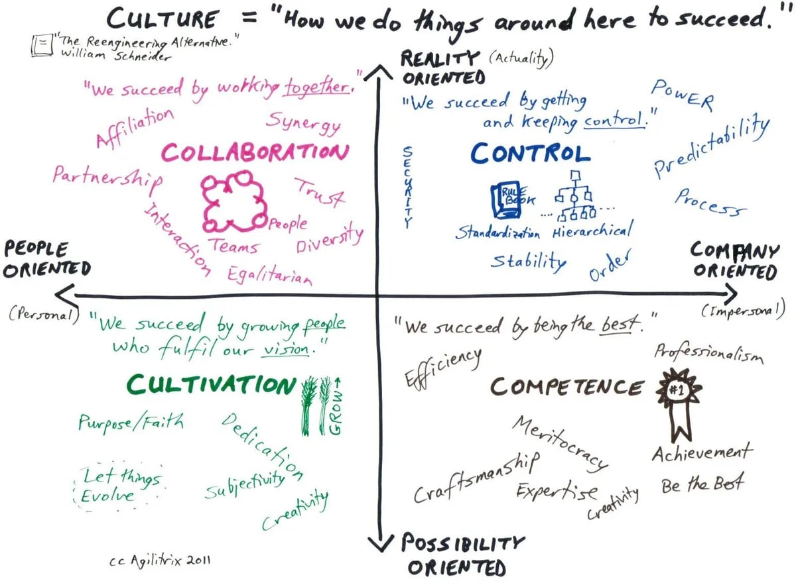

Есть четыре архетипа корпоративной культуры по Шнайдеру. Вот они.

Знаете, что интересно? Власть менеджера проявляется в каждом из четырех очень по разному. От него требуются разные качества, и разные умения.

Корпоративная культура и ее типизация по Шнайдеру объективно существует, и может быть измерена. Она почти никогда не совпадает с тем, что вам говорят о культуре вслух. Иногда — не совпадает с точностью до наоборот.

И вот только поэтому — вы никогда не знаете, как пройдет собеседование на должность менеджера.

Я умею работать во всех четырех. Это не помогает. Наоборот. Для успеха, надо отвечать по долбоебски. Выбрав один тип культуры, и делая вид, что ничего кроме него не умеешь.

