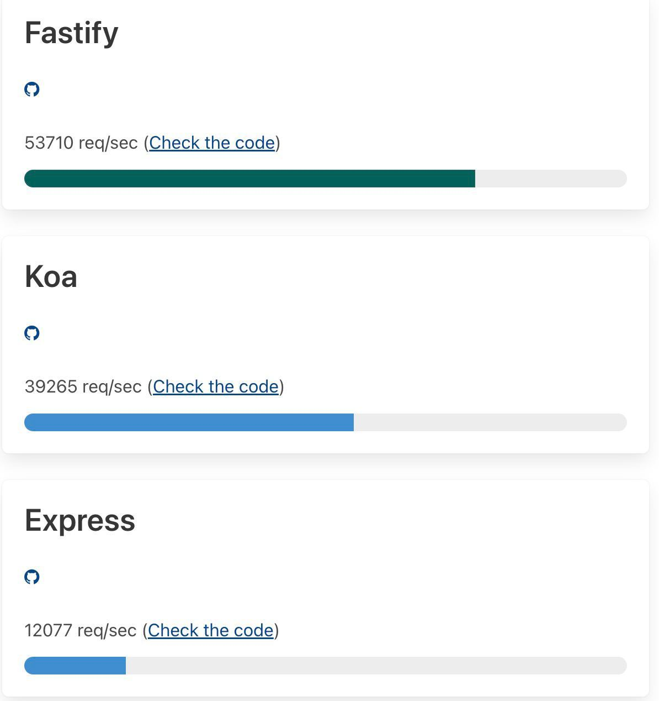

**О Fastify**

Это unopinionated фреймворк для REST API, который **очень быстрый**.

Все что надо там есть, в том числе поддержка async/await, валидация, генерация swagger документации из кода, и проброс HTTP-ошибок исключениями. А чего не надо (разной ебанины от девелоперов которые пытаются учить других как надо делать **правильно**) -- нет.

Думаю, быстро соберу на коленке либу для человеческого описания JSON-схем (на основе своего языка описаний атрибутов в Type-R), добавлю обертку для определения REST-ресурса, чтобы можно было вызывать методы локально и девелоперы не косячили, и все.

Что такое unopinionated framework объяснять лень, так что я попросил open AI объяснить. Вот:

An unopinionated framework is a type of software framework that provides a set of basic tools and features, but does not impose specific design or architectural decisions on the developer. This allows the developer to have more flexibility and control over the design and implementation of their application, and allows them to choose the specific tools, libraries, and design patterns that best suit their needs and preferences.

In contrast, an opinionated framework is a type of software framework that comes with pre-defined design and architectural decisions, and often imposes these decisions on the developer. This can make it easier to get started with the framework, but can also limit the flexibility and control of the developer, as they may need to conform to the framework's pre-defined decisions in order to use its features and tools.

In general, unopinionated frameworks are considered to be more flexible and versatile than opinionated frameworks, as they allow the developer to have more control over the design and implementation of their application. However, opinionated frameworks can be useful for developers who are new to the framework and want to quickly get up and running with a pre-defined set of tools and features.

