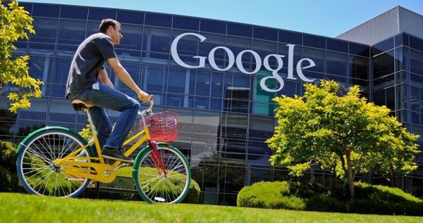

Насчет AI чат-ботов — на примере ChatGPT мы на самом деле наблюдаем революцию, которая может если не увести поиск в могилу, то очень сильно снизить его популярность.

Надо отметить, что у чатботов куда больше потенциал по манипуляции общественным мнением, чем у поиска. Там довольно просто создать нужный bias. Это касается и рекламы, и политики.

https://www.cnews.ru/news/top/2022-12-23_v_google_ispugalis_chat-botov

