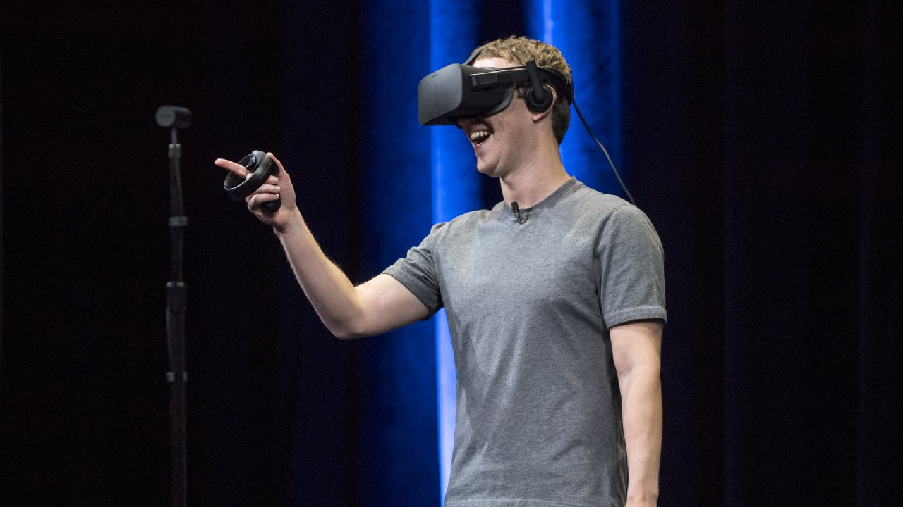

https://www.cnbc.com/2022/12/28/metaverse-off-to-ominous-start-after-vr-headset-sales-shrank-in-2022.html

Продажи VR оборудования упали на 2% в 2022 году. Удивительно. Но VR людям не зашел.

То есть, конечно не удивительно. 3D кино раньше не зашло. 3D телевизоры не зашли. А в шлемах — многим дискомфортно и хочется блевать. И контента интересного практически нет. Там не просто неудобно и дискомфортно. В первую очередь — там скучно. Возвращаться лень, и незачем.

Просто последний десяток лет в секторе технологий надувался очередной пузырь. И в 2022-м году он лопнул. И выяснилось, что многие техно-компании делают странные, никому не нужные вещи.

Не знаю, может и придумают что нужное с VR. Но пока технология явно не там. С чем можно горячо поздравить ящерицу Цука. Всю ставку на метавселенную сделал, да?

