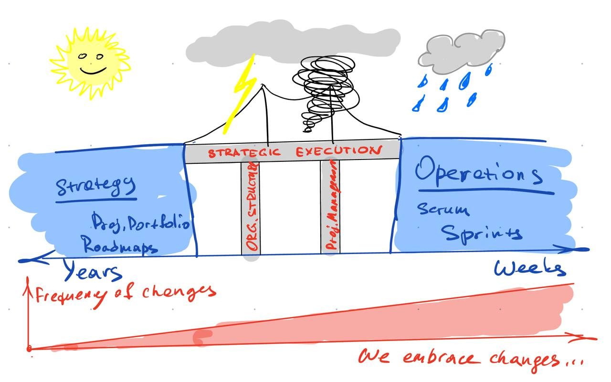

Иллюстрация к предыдущему посту.

Изменения и быстрая обратная связь, т.е. __гибкость __на тактическом уровне — важно и нужно.

Когда портфель стратегических инициатив меняется раз в три месяца до того как что-то успело завершиться или даже толком начаться — что-то не так в консерватории. Нет там никакой обратной связи по спринту в две недели и не может быть, это чистый бардак.

А если еще и мостик этот между стратегией и оперейшнс до кучи ебнули — так ваще.

Agile — это не ответ на проблемы бизнеса. Это решение маленькой частной проблемки тактического уровня.

